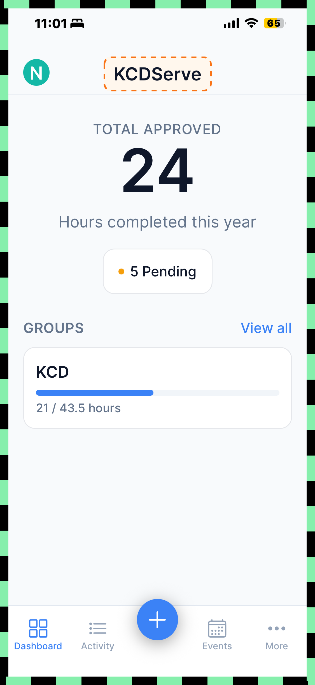

# Kcd Serve

This is a mobile app (expo + react native) and a backend of rails for a movile serve alternative.

## Why is this just folders
mono repo,, 

backend folder is rails app

mobile folder is the expo app

## How do i run this locally
Check the README's for the folder u want to run!

### Meow?
Meow (please accept horizons)